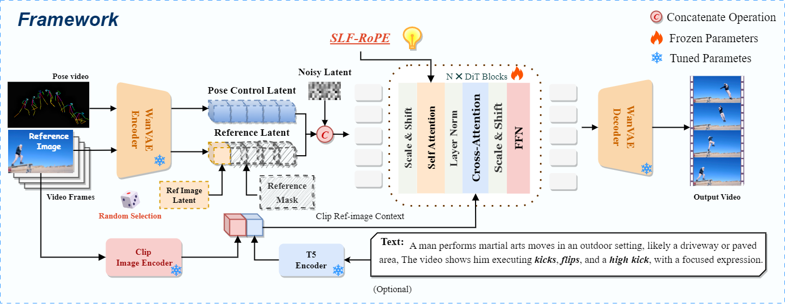

<h2> 
  <a href="https://arxiv.org/abs/2505.22977">
    HyperMotion: DiT-Based Pose-Guided Human Image Animation of Complex Motions
  </a>
</h2>

This repository is the official implementation of [HyperMotion](https://vivocameraresearch.github.io/hypermotion/)

<a href="https://arxiv.org/abs/2505.22977"></a>&nbsp;
<a href="https://huggingface.co/shuolin/HyperMotion"></a>&nbsp;
<a href='https://vivocameraresearch.github.io/hypermotion/'>
  </a>
<a href="http://www.apache.org/licenses/LICENSE-2.0"></a>&nbsp;
<a href="https://docs.google.com/forms/d/e/1FAIpQLSfWK4a7GqI-Yc8GIWcYmUcmZgdnI-vIYQZ1wrXJNQCrDtABQA/viewform?usp=header"></a> &ensp;

## 📣 News:
We'll be open-sourcing model weights, inference/train scripts, and methods for obtaining pose sequences in June 2025.  
🎉 We have sent data to the first batch of applicants!  
🎉 Now you can download the weights from 🤗[**HuggingFace**](https://huggingface.co/shuolin/HyperMotion).



### The Open-HypermotionX training dataset and the HypermotionX bench are available at [this application link](https://docs.google.com/forms/d/e/1FAIpQLSfWK4a7GqI-Yc8GIWcYmUcmZgdnI-vIYQZ1wrXJNQCrDtABQA/viewform?usp=header)!!!

## ✅ To-Do List for HyperMotion Release

- [✅] Release the Open-HypermotionX dataset
- [✅] Release the HypermotionX bench
- [✅] Release the source code
- [✅] Release the inference file
- [✅] Release the Xpose process scripts
- [✅] Release the training data Full processing scripts
- [✅] Release the pretrained weights
- [ ] Release the resize pose code
- [ ] Release the training file & details (wan-2.1_14B 8*H20 96G sft)

## 😘 How to get Open-HyperMotionX training dataset from [Motion-X](https://github.com/IDEA-Research/Motion-X) (easy).
We are so sorry that due to force majeure caused by company's regulations, we can't upload the processed training set‘s videos directly, but we will give you the complete ways to get the HypermotionX training data from Motion-X.  Including video name ID, original pose annotation, **Follow these steps to process the Motion-X dataset:**
If you have any questions about processing data and obtaining Xpose weights, please do not hesitate to contact us [email](xushuolin0420@gmail.com).

<details>
<summary>📍Click to expand detailed instructions📍</summary>
  
### 0. Preparing the data processing environment
```
conda create -n hypermotionX python==3.10
conda activate hypermotionX
cd train_data_processing
pip install -r requirements.txt
```
### 1. Download Motion-X Dataset (The completed form will be sent immediately)
Please fill out [this form](https://docs.google.com/forms/d/e/1FAIpQLSeb1DwnzGPxXWWjXr8cLFPAYd3ZHlWUtRDAzYoGvAKmS4uBlA/viewform) to request authorization to use Motion-X for non-commercial purposes. Then you will receive an email and please download the motion and text labels from the provided downloading links. The pose texts can be downloaded from [here](https://drive.google.com/file/d/168ja-oBTHM0QDKFIcRriQFPew5gUlZkQ/view?usp=sharing).

- Please collect them as the following directory structure, We only use the following parts of the data:
```
../Motion-X++ 

├──  video
  ├── perform.zip
  ├── music.zip
  ├── Kungfu.zip
  ├── idea400.zip
  ├── humman.zip
  ├── haa500.zip
  ├── animation.zip
  ├── fitness.zip(no need)
├──  text
  ├── wholebody_pose_description(no need)
  ├── semantic_label
    ├── perform.zip
    ├── music.zip
    ├── Kungfu.zip
    ├── idea400.zip
    ├── humman.zip
    ├── haa500.zip
    ├── animation.zip
├── motion
  ├──  motiion_generation(no need)
  ├──  mesh_recovery(no_need)
  ├──  keypoints
    ├── perform.zip
    ├── music.zip
    ├── Kungfu.zip
    ├── idea400.zip
    ├── humman.zip
    ├── haa500.zip
    ├── animation.zip
```
Unzip all files.
### 2. Filter the required source video based on the video ID list provided
```
cd train_data_processing
python fetch_videos_by_id.py \
  --json ./video_metadata.json \
  --source /data/motionX/video/ \
  --target /data/datasets/filtered_videos/ \
  --video_ext .mp4
```
### 3. Filter the required source kepoints files based on the json ID list provided
```
python fetch_videos_by_id.py \
  --json ./video_metadata.json \
  --source /data/motionX/motion/keypoints/ \
  --target /data/datasets/filtered_kpts/ \
  --extra_exts .json
```
Data structure:
```
/data/filtered_videos/
  ├── backflip_8_clip1.mp4
  ├── ...

/data/filtered_keypoints/
  ├── backflip_8_clip1.json
  ├── ...
```
At this moment we have all the source data for the hyprtmotionX dataset.

### 4. Initial visualisation as pose videos
```
cd train_data_processing

python vis_kpt.py \
    --video_dir ./data/datasets/filtered_videos \
    --json_dir ./data/datasets/filered_kpts \
    --output_dir ./data/datasets/video_pose

python batch_convert_to_h264.py
    --input_dir ./data/datasets/video_pose \
    --output_dir ./data/datasets/pose_video \

rm -r ./data/datasets/video_pose
```
### 5. Filtering high-frequency motion clips
Deal with pose_video:
```
python cwt_framebased_batch_startend_reencode.py \
    --video_dir ./data/datasets/pose_video \
    --json_dir ./data/datasets/filered_kpts \
    --output_dir ./data/datasets/control_videos \
    --clip_seconds 6.0 \
    --keypoint_type body \
    --max_points 17 \
    --joint_index 0 \
    --wavelet morl \
    --max_scale 128 \
    --min_spike_width 3 \
    --shift_margin 10
```
Deal with videos:
```
python cwt_framebased_batch_startend_reencode.py \
    --video_dir ./data/datasets/filtered_videos \
    --json_dir  ./data/datasets/filered_kpts \
    --output_dir ./data/datasets/videos \
    --clip_seconds 6.0 \
    --keypoint_type body \
    --max_points 17 \
    --joint_index 0 \
    --wavelet morl \
    --max_scale 128 \
    --min_spike_width 3 \
    --shift_margin 10
```
### 6. Add OCR Gaussian Blur Mask (optional)
```
python ocr_mask.py
    --input_dir ./data/datasets/videos \
    --output_dir ./data/datasets/gt_videos \
    --device gpu --blur_strength 51

rm -r ./data/datasets/videos
```
#### If vscode dosen't show videos, please run the scripts
```
python batch_convert_to_h264.py
    --input_dir ./data/datasets/gt_videos \
    --output_dir ./data/datasets/videos_gt \
```
At this point we have control_videos and videos_gt two folders.

### 7. Text annotation (optional)
1. Reference fetch_videos_by_id.py collect all text labels from the semantic_label folder.
2. Since the original text is rather simple and lacks a description of the character's appearance, you can download [InternVL3.0](https://internvl.readthedocs.io/en/latest/internvl3.0/introduction.html) and mark it up yourself.
```
# Add HF_ENDPOINT=https://hf-mirror.com before the command if you cannot access to huggingface.com
huggingface-cli download OpenGVLab/InternVL3-14B --local-dir-use-symlinks False --local-dir /PATH/TO/INTERNVL3_MODEL

python video_description.py
    --video_folder ./data/datasets/videos_gt  \
    --output_folder   ./data/datasets/og_text  \
    --model_path /PATH/TO/INTERNVL3_MODEL \
    --num_workers 1 \
    --batch_size 64
```
3. Prompt words beautification
```
# Download it from https://huggingface.co/NousResearch/Meta-Llama-3-8B-Instruct or https://www.modelscope.cn/models/LLM-Research/Meta-Llama-3-8B-Instruct to /path/to/your_llm

python process_llama.py
    --model_path /path/to/your_llm \
    --input_folder ./data/datasets/og_text \
    --output_folder ./data/datasets/text --gpu 0
```
### 🎊 Successfully accomplished 🎉🎉🎉
```
/data/datasets/
  ├── videos_gt
  ├── control_videos
  ├── videos_gt
```
At this point we have successfully obtained all the training data!

</details>

## ⚙ Install
We have verified this repo execution on the following environment:

The detailed of Linux:
- OS: Ubuntu 20.04, CentOS
- python: python3.10 & python3.11
- pytorch: torch2.2.0
- CUDA: 11.8 & 12.1 & 12.3
- CUDNN: 8+
- GPU：Nvidia-V100 16G & Nvidia-A10 24G & Nvidia-A100 40G & Nvidia-A100 80G

```shell
# python==3.12.9 cuda==12.3 torch==2.2
conda create -n hypermotion python==3.12.9
conda activate hypermotion
pip install -r requirements.txt
```
⚠ If you encounter an error while installing Flash Attention, please [**manually download**](https://github.com/Dao-AILab/flash-attention/releases) the installation package based on your Python version, CUDA version, and Torch version, and install it using `pip install flash_attn-2.7.3+cu12torch2.2cxx11abiFALSE-cp312-cp312-linux_x86_64.whl`.

⚠ We need about 60GB available on disk (for saving weights), please check!

⚠ But just for inference only need < 24GB, even 16GB! So single RTX4090 is enough.

⚠ About H20 GPU's bug, if yor meet the error about bf16 for train or inference please reference the [Link](https://github.com/vllm-project/vllm/issues/4392)

## ⬇️ Checkpoint download

### [hyper-wan2.1-14B-1.0](https://huggingface.co/shuolin/HyperMotion)
```
# Add HF_ENDPOINT=https://hf-mirror.com before the command if you cannot access to huggingface.com
huggingface-cli download shuolin/HyperMotion --local-dir ./ckpts
```

## 🗿 Inference data preparation
### Why use [Xpose](https://github.com/IDEA-Research/X-Pose)?
Because Xpose is much more accurate than Dwpose, it generalizes more, and is suitable for children, animals, anthropomorphic characters, and complex motion.
### How to use [Xpose](https://github.com/IDEA-Research/X-Pose) to get Pose video
 You can download the pretrained weights of Xpose from [here](https://drive.google.com/file/d/13gANvGWyWApMFTAtC3ntrMgx0fOocjIa/view) and put it under `./XPose/weights`.
```
git clone https://github.com/IDEA-Rensearch/X-Pose.git
cd X-Pose

pip install -r requirements.txt

cd models/UniPose/ops
python setup.py build install
# unit test (should see all checking is True)
python test.py
cd ../../..

mv ./xpose_batch_inference.py ./XPose
mv ./xpose_vis_personface.py ./XPose
mv ./xpose_vis_allpy ./XPose
```
Key Point Detection
```
python xpose_batch_inference.py \
  --config /path/to/config/UniPose_SwinT.py \
  --checkpoint /path/to/unipose_swint.pth \
  --video_folder /path/to/videos \ # your video
  --output_dir /path/to/output \ # json
  --instance_prompt person\ # face, hand
  --keypoint_type person \ # face, hand
  --frames_per_clip 8 \
  --gpu 0
```
Visualization to pose video
```
# only visual body & face
python xpose_vis_personface.py \
    --video_dir /path/to/videos \
    --body_json_dir /path/to/body_json \
    --face_json_dir /path/to/face_json \
    --output_dir /path/to/pose_videos

# visual body, face & hand
python xpose_vis_all.py \
    --video_dir /path/to/videos \
    --body_json_dir /path/to/body_json \
    --hand_json_dir /path/to/hand_json \
    --face_json_dir /path/to/face_json \
    --output_dir /path/to/pose_videos

python batch_convert_to_h264.py
    --input_dir /path/to/pose_videos \
    --output_dir /path/to/pose_video \
```

## 😁 Inference
### First step
- Go to scripts/inference.py and set the path of model weights and input conditions correctly.
```
# Config and model path
config_path         = "config/wan2.1/wan_civitai.yaml"
# model path
model_name          = "........./model/hypermotion_14B" # model checkpoints
.......
# Use torch.float16 if GPU does not support torch.bfloat16
# ome graphics cards, such as v100, 2080ti, do not support torch.bfloat16
weight_dtype            = torch.bfloat16
control_video           = "......./test.mp4" # guided pose video
ref_image               = "......./image.jpg" # reference image
```
### Second step
- Running inference script.
```
python inference.py
```
- Batch inference script.
```
json_path = "............../inference_config.json"
save_path = "......../sample/results"
config_path = "config/wan2.1/wan_civitai.yaml"
model_name = "............../hypermotion_14B"
```
```
python inference_batch.py
```

## 😘 Acknowledgement
Our code is modified based on [VideoX-Fun](https://github.com/aigc-apps/VideoX-Fun/tree/main). We adopt [Wan2.1-I2V-14B](https://github.com/Wan-Video/Wan2.1) as the base model. And we referenced [UniAnimate](https://github.com/ali-vilab/UniAnimate), Our data is inherited from [Motion-X](https://github.com/IDEA-Research/Motion-X), then we use [EasyOCR](https://github.com/JaidedAI/EasyOCR) to deal with videos, and [InternVL2](https://github.com/OpenGVLab/InternVL) to generate text dic. We use [Xpose](https://github.com/IDEA-Research/X-Pose) to generate pose video. Thanks to all the contributors! Special thanks to [VideoX-Fun](https://github.com/aigc-apps/VideoX-Fun/tree/main), without that work as a foundation there would be no work for us!

Also thanks to [UniAnimate](https://github.com/ali-vilab/UniAnimate) and [FollowYourPose](https://github.com/mayuelala/FollowYourPose).

## 😊 License
All the materials, including code, checkpoints, and demo, are made available under the [Creative Commons BY-NC-SA 4.0](https://creativecommons.org/licenses/by-nc-sa/4.0/) license. You are free to copy, redistribute, remix, transform, and build upon the project for non-commercial purposes, as long as you give appropriate credit and distribute your contributions under the same license.

## 🌏 Citation
<pre> 
  @misc{xu2025hypermotion,
    title={HyperMotion: DiT-Based Pose-Guided Human Image Animation of Complex Motions}, 
    author={Shuolin Xu and Siming Zheng and Ziyi Wang and HC Yu and Jinwei Chen and Huaqi Zhang and Bo Li and Peng-Tao Jiang},
    year={2025},
    eprint={2505.22977},
    archivePrefix={arXiv},
    primaryClass={cs.CV},
    url={https://arxiv.org/abs/2505.22977}, 
  }
</pre>
